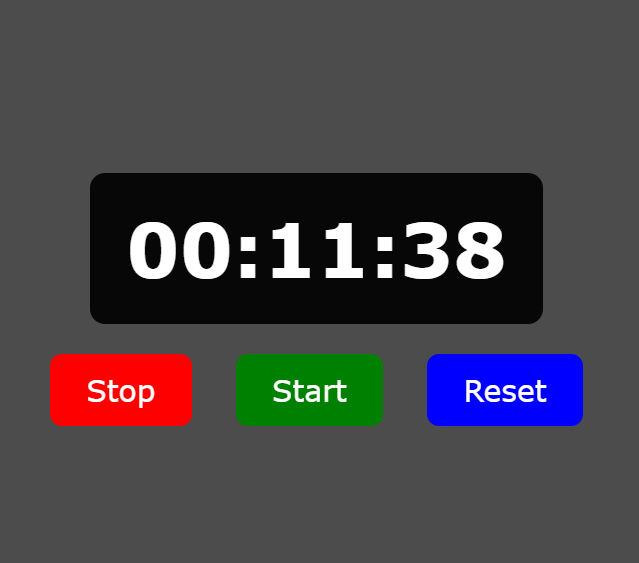

# Stopwatch ⏱️

A simple and elegant stopwatch web app built with **HTML, CSS, and JavaScript**.  
You can start, stop, and reset the timer with a clean user interface.

---

## 🚀 Live Demo
👉 [View Stopwatch](https://aryanbhardwaj4224.github.io/Stopwatch/)

---

## 📸 Preview


---

## ✨ Features
- Start, Stop, and Reset functionality  
- Millisecond precision  
- Responsive and minimal UI  
- Built using pure **vanilla JavaScript** (no libraries)  

---

## 🛠️ Tech Stack
- **HTML5** for structure  
- **CSS3** for styling  
- **JavaScript (ES6)** for logic  

---

## 📂 Project Structure
```bash
Stopwatch/
│── index.html
│── style.css
│── script.js
│── iprev[2].png   # Project preview image
```
---

## 📖 How to Use
### 1.Clone the repository:
```bash
git clone https://github.com/Aryanbhardwaj4224/Stopwatch.git
```
### 2.Open `index.html` in your browser.

---

## 📌 Future Improvements
- Add lap functionality
- Dark/Light theme toggle
- Keyboard shortcuts

---

## 👤 Author
### **Aryan Bhardwaj**
